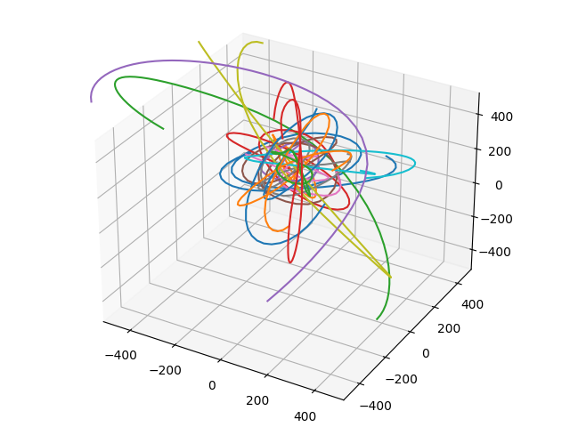

# m_body_problem
Simulating the m-body problem using Leapfrog integration (kick-drift-kick).
Simulation is ready to run and will be further developed.

 

 
Future versions will be aimed to represent planetary systems and will be calibrated accordingly